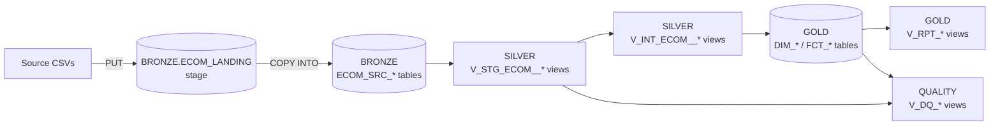

Personal Explanations

Hi, thank you for the opportunity. I got to learn a lot; I hadn't gotten to use cli integrations with snowflake and dbt much before, only IDEs. I wanted to explain my thought process here on top of the summary of decisions provided below.

My understanding of this exercise after seeing the capabilites of LLMs like claude code paired with snow cli is that any engineer should be able to build a warehouse with just a few prompts. What sets professional experience apart from just configuring connectors and writing prompts is the ability to know when your coding agent may be incorrect while being able to provide a reasonable explanation for architectural decisions.
My goal here was to build a DWH in the medallion architecture, accounting for data issues surfaced in the source files as well as pointing out what I would do differently given the time to build a large scale enterprise data warehouse. 

Keeping it simple, bronze was built to house raw data in snowflake. I named it by source, so as the company scales and requires more sources, it wouldn't affect our design. As an example, this would help if we have let's say 3 different customer sources to differentiate but will be combined downstream. Different than the staged csv files ingested in the same schema but in a table format for longevity. 
Everything after bronze, I used dbt for. I chose to use dbt instead of Snow stored procedures because it allows for automatic DAG/lineage observability and I am more familiar with the syntax. 
Silver I split into 2, staging vs intermediate; staging wasn't needed in this case but in an enterprise solution, this design will be useful. Staging is strictly for data type changes, renames of fields, adding traceable audit columns, etc. Int is where the transformations happen, all the logic changes and filters being in one place help troubleshooting down the line; (don't have to search the whole DAG for issues). 
Everything in silver I created as views, reason being simply that it saves compute overhead in a production environment. These int views wouldn't be queried except through the dbt runs, making them very cost effective. If we suddenly saw a lot of query activity on the silver views, that's when the decision could be justified to convert them into tables.

Gold is also self explanatory, this is where the data model lies. Using the sample data, I was unsure if dim location or brand would be needed as separate dims instead of as attributes to products or inventory. I included only location but with more time and analysis, I believe brand could also become one.  Customer and product dims were designed as SCD type 2 because in just 2 days, I saw an important change in the values of their unique grain key. These are designed as tables because they will be queried often and can't be rebuilt each time a query hits it. Strategy is incremental merge, one to save on compute that results from truncate and load but the merge on unique key also accounts for a new file that comes in with half old data and half new data. 
For both bronze and gold, in an enterprise solution I would make this an iceberg table for platform independence and storage/compute cost benfits; elaborated on this below. 


How I used AI

I used Claude Code as part of VS Code with connections to Git, snow cli and dbt for most of the hands-on work. I made the design calls and pushed back where I didn't agree:
I don't think this would have been possible within 2 hours without a native coding agent; creating a model and architecting a schema from scratch just typing and running those queries would take ages which is where I believe AI provides a huge advantage.
It profiled the source files with a script rather than by eye, which is how the subtotal inconsistency and the late C016 came up early.
It drafted the SQL and the dbt models while I reviewed and shaped them. Some decisions went its way: it talked me into the three lineage columns in bronze after I'd said no extra columns. Others went mine: the `ECOM_SRC_` naming, the staging/intermediate split, incremental MERGE over truncate-and-reload, readable `a~b~c` keys and the `V_` view prefix.
I batched each round of Snowflake work into single script runs, both for the credit budget and to cut down on Oauth sign-ins caused by MFA not working well with Snow CLI.
It got things wrong a couple of times:
The worst was loading Day 1 and Day 2 together at the start. I had it roll that back so Day 2 could be tested as a real second delivery.
It also told me Iceberg wasn't possible on this account, reasoning from the missing external-volume privileges. That turned out to be wrong once we actually tried it
I had it write the acceptance checks and demo queries from the source README, and I used those to verify the end result.


If I had more time…

These are the things I left out to stay within the timebox.
Currently, I have no check for deleted records. Normally I do that through fivetran; I would want to learn the best way to implement a deleted record check at source or stage natively in Snowflake. Claude recommended I ask the source for a delete or tombstone signal, or for full order snapshots, so removed lines can be retired.
Adding Orchestration, right now the steps are run by hand. I'd set up a Snowflake task graph (land → copy → dbt build → checks) with alerting on failure, with Snowpipe feeding bronze from a real bucket.
Move dev and prod into separate databases instead of prefixed schemas. 
Add CI/CD automation, run `dbt build` against the `dev` target on every pull request, using slim CI on modified models only, and deploy the dbt project on merge. My current company Git environment is set to run only modified objects in dbt.
RBAC implementation, only see my role right now which makes sense for the take home but wouldn't in production. Masking policies on email and names. With multiple brands, row access policies might also be needed if brand teams should only see their own data.
Schema drift check. Alert when a file shows up with columns bronze doesn't have. Route rows that fail typing into a rejects table with the reason, instead of only reporting them.
Better type 2 scd implementation. Version field as I set it up does work, but I think there are better ways to do this for scaling purposes. Maybe I could switch the version key to `id~valid_from` (for example `C003~2026-09-02T15:05:00`). It's still readable and at the true grain, and unlike a version number it doesn't shift meaning when a late version is inserted. 
Add dbt unit tests for the history macro, into the yml. Also I normally wouldn't do this transformation through a macro like this, instead build the unique transformations into the model itself. 
Iceberg for bronze and gold, once other engines need to read the data: on an external volume over our own bucket rather than Snowflake storage, after testing the COPY and MERGE paths mentioned above.
Put resource monitors on each warehouse and attribute credits by query tag. This whole exercise used well under half a credit of the 5 available.
There are many additional schemas created to house business reports, tests, metadata etc. This was done by claude and I didn't have the time to review it all but I left it in to show what production standard might look like. 


# Commerce analytics platform on Snowflake + dbt

This repo takes the two days of e-commerce extracts (customers, products, order headers, order lines and inventory) and builds them into a layered platform in Snowflake: a raw landing layer, a cleaned and conformed layer, and a star schema analysts can actually query. The files are tiny, but I built this the way I'd want the first slice of a real platform to look for a ~$500M multi-brand business with many sources, tens of millions of rows and a lot of downstream users. Some of it is deliberately more than 164 rows need.

## Architecture



| Schema | What's in it | How it's built |
|---|---|---|
| `BRONZE` | `ECOM_LANDING` stage, holding every delivered file untouched, and the `ECOM_SRC_*` raw tables | Stage + tables loaded with `COPY INTO` |
| `SILVER` | `V_STG_ECOM__*` (typed, renamed) and `V_INT_ECOM__*` (deduplicated, current state, history) | dbt views |
| `GOLD` | `DIM_*` / `FCT_*` star schema, plus `V_RPT_*` reporting views | dbt incremental `MERGE` tables, plus views |
| `QUALITY` | `V_DQ_ISSUES`, `V_DQ_SUMMARY` | dbt views |
| `OPS` | The dbt project object (`OPS.DWH`) and its upload stage | n/a |

The rule I used for the boundaries is simple:
- Bronze never interprets anything.
- Silver never loses anything, so it can always be rebuilt from bronze.
- Gold only holds modeled, tested data.
- Quality sits off to the side and reports problems without blocking the pipeline.

Every view in every schema starts with `V_`, so you can tell a view from a physical table by the name alone.

```
setup/01_create_schemas.sql      schemas
bronze/01_bronze_objects.sql     file format, landing stage, raw tables
bronze/02_land_delivery.sql      PUT one delivery into the landing stage
bronze/03_copy_into_bronze.sql   COPY anything not loaded yet into bronze
dbt/                             silver, gold and quality models (deployed as OPS.DWH)
demo/                            example queries (sales, inventory, data quality) and acceptance checks
Lead_Data_Engineer_Source_Data/  the source extracts
```

## Major design decisions

### Bronze is a landing zone, but with lineage

My first instinct was to load bronze strictly as-is with nothing added. I ended up keeping three columns that Snowflake hands you for free during `COPY`: `_SOURCE_FILE_NAME`, `_SOURCE_FILE_ROW_NUMBER` and `_LOADED_AT`. The customer and product files are full snapshots with no as-of date inside them, so the file name is the only thing that tells you which delivery a row came from. Without it you can't build history or detect deletes. The lineage columns also let you tell a duplicate the source sent apart from a file that got loaded twice, and trace any number in gold back to a file and row.

Everything else is loaded exactly as delivered, and all as text. A bad date or price never fails the load; typing happens in silver, where failures show up as data-quality issues.

Columns are matched by header name, not position (`MATCH_BY_COLUMN_NAME`), so a source reordering its columns can't put values in the wrong place. The trade-off is that Snowflake requires `ERROR_ON_COLUMN_COUNT_MISMATCH = FALSE` for this setup. A short row loads with NULLs instead of failing, and the `missing_or_invalid_value` check catches it. A brand-new source column is ignored until it's added to the table.

Raw tables are named `<SOURCE>_SRC_<ENTITY>` (for example `ECOM_SRC_ORDER_HEADERS`), so they group by source system once there's more than one.

### Standard tables, not Iceberg (for now)

The account runs on AWS (us-east-2). At first I assumed Iceberg wasn't possible here, because the candidate role can't create an external volume. Snowflake now has Snowflake-managed storage for Iceberg (`EXTERNAL_VOLUME = SNOWFLAKE_MANAGED`), though, and a test table created fine under the candidate role. I kept standard tables anyway, on purpose:
- **Snowflake is the only engine reading this data today.** Native tables are simpler and faster, and they come with Time Travel and Fail-safe with nothing to manage.
- **The enterprise version would use my own bucket.** In, say, a GCP shop, I'd put bronze and gold in Iceberg on an external volume over a GCS bucket, since Snowflake storage for Iceberg isn't available on GCP-hosted accounts. An admin sets that up once and grants it to the loading and transform roles.


### Silver is staging plus intermediate, all views

Normally I split silver into two parts:
- **Staging:** rename, cast and standardize.
- **Intermediate:** the transformations that get you to a clean select for gold.

I kept both even for a take-home. The split is cheap, and it's where the value shows up at scale: source quirks get absorbed once in staging, and business logic only ever sees clean, typed columns. Staging uses `TRY_` casts, so anything that can't be cast becomes a NULL that the tests and the DQ view pick up.

Silver is all views. Bronze keeps every delivery, so silver is just a repeatable calculation on top of an immutable record: rebuild it any time and you get the same answer. The physical, incremental work happens in gold.

Customer and product history comes from stacking the snapshots (`history_from_snapshots` macro) rather than `dbt snapshot`. Each delivery is compared with the previous one by a content hash, and a new version only opens when something actually changed. A key that drops out of the latest snapshot gets flagged `is_deleted_in_source`; nothing is physically deleted. The advantage over `dbt snapshot` is that the history isn't state living in a single table, so it can be rebuilt from bronze at any time.

For the incremental feeds (orders and lines), the latest `updated_at` per key wins, and ties go to the most recently loaded row. Exact duplicates collapse there.

### Gold is a star schema, incrementally merged, with readable keys

| Table | Grain | Key |
|---|---|---|
| `DIM_CUSTOMER` | customer version (type 2) | `customer_id~version`, e.g. `C003~2` |
| `DIM_PRODUCT` | product version (type 2) | `product_id~version` |
| `DIM_LOCATION` | warehouse | `location_id` |
| `DIM_DATE` | day | `date_day` |
| `FCT_ORDER_LINES` | order line, current version (the main sales fact) | `order_line_id` |
| `FCT_ORDERS` | order, current version | `order_id` |
| `FCT_INVENTORY_SNAPSHOT` | date × location × product | `snapshot_date~location_id~product_id` |
| `V_RPT_DAILY_SALES` | date × brand × category | n/a |
| `V_RPT_INVENTORY_POSITION` | location × product at the latest snapshot | n/a |

**Incremental MERGE, not truncate and reload.** Every fact and dimension is a permanent table merged on its key, so a run only writes what changed:
- **Facts** pick up rows loaded after the table's high-water mark (`_source_loaded_at`), plus anything still pointing at an `UNKNOWN~0` member, so late arrivals get fixed. A line's watermark is the later of the line itself and its header, so cancelling an order re-states its lines too.
- **Dimensions** only merge versions that are new or changed, detected with a row hash.
- **Duplicate keys** are removed in each model before the merge. Snowflake's `MERGE` either errors or behaves nondeterministically when the source has duplicate keys, so this is the last line of defense if something slips past silver.
- **Permanent tables.** Gold tables are `transient: false`, because dbt's Snowflake default is transient and I don't want that for the physical layer.

**Readable keys instead of hashes.** A key is the actual values at the table's grain, joined with `~`. It's much easier to debug and trace a row by eye.

**Revenue comes from the lines.** The source doesn't use the header `subtotal` consistently (see below). `FCT_ORDERS` keeps the header amounts, since tax and shipping only exist there, plus an `is_reconciled` flag against the lines.

**Point-in-time joins.** Facts point at the customer or product version that was valid when the order was placed, so price, cost and brand are historically right. The first version of each customer and product reaches back to 1900-01-01 for joining. That way an order timestamped before its customer record was created still finds it, and it still gets flagged. Facts with no match point at `UNKNOWN~0` instead of being dropped.

**Cancelled orders stay in the facts** with `is_cancelled`. Reporting excludes them from net sales but still counts them.

### dbt runs inside Snowflake

dbt is deployed as a Snowflake dbt project object (`OPS.DWH`, dbt Core 1.11.11 pinned). You can run it from the CLI, from SQL, or from the Workspace connected to this repo:
- **Environments:** the `prod` target writes to the exact schema names. Any other target writes to `DEV_*` schemas, so dev work never touches shared data.


## How to reproduce

You need the Snowflake CLI (`snow`) with a connection to the account set as default, and a role that can create schemas in `CANDIDATE_SHIVUM` and use `CANDIDATE_SHIVUM_WH`.

```bash
# schemas and bronze objects (DDL only)
snow sql -f setup/01_create_schemas.sql
snow sql -f bronze/01_bronze_objects.sql

# Day 1: land the files, load whatever is new
snow sql -f bronze/02_land_delivery.sql -D "delivery_dir=<absolute path>/Lead_Data_Engineer_Source_Data/day_1"
snow sql -f bronze/03_copy_into_bronze.sql

# deploy dbt to Snowflake and build silver, gold and quality (models + tests)
snow dbt deploy DWH --source dbt --profiles-dir dbt --database CANDIDATE_SHIVUM --schema OPS --dbt-version 1.11.11
snow dbt execute --database CANDIDATE_SHIVUM --schema OPS DWH build

# Day 2: same two bronze commands with day_2, then build again
snow sql -f bronze/02_land_delivery.sql -D "delivery_dir=<absolute path>/Lead_Data_Engineer_Source_Data/day_2"
snow sql -f bronze/03_copy_into_bronze.sql
snow dbt execute --database CANDIDATE_SHIVUM --schema OPS DWH build

# verify: every row should say PASS. Repeat the Day 2 block and run it again to prove the rerun is a no-op.
snow sql -f demo/day2_acceptance_checks.sql

# example reporting and data-quality queries (or open them in a Snowsight worksheet)
snow sql -f demo/01_sales_and_orders.sql
snow sql -f demo/02_inventory.sql
snow sql -f demo/03_data_quality.sql
```

## How updates, duplicates and reruns are handled

There are three layers of protection, so a rerun has to get past all of them before it could double count:

1. **Landing.** `PUT ... OVERWRITE = FALSE` skips any file already in the stage. A correction has to come in as a new file.
2. **Bronze.** `COPY INTO` keeps a per-table load history and skips files it has already loaded. It's never run with `FORCE = TRUE`.
3. **Silver and gold.** Duplicate rows can still reach bronze: the source sends a record twice, someone forces a reload, or a file gets resent under a new name. Silver collapses them by key and latest `updated_at`, and gold removes duplicate keys again before merging.

Changes flow through the same way. A changed order or line replaces its earlier version in silver, and the gold `MERGE` updates the existing fact row. A changed customer or product becomes a new version in history. Gold closes the old version and inserts the new one, while existing facts stay pinned to the version that was valid at the time.


| | After Day 1 | After Day 2 | Day 2 rerun |
|---|---|---|---|
| Files | 5 loaded | 5 loaded | 5 skipped, 0 loaded |
| Orders / lines / inventory rows in gold | 12 / 19 / 24 | 20 / 33 / 50 | 20 / 33 / 50 |
| Net sales (excluding cancelled) | 1,177.60 | 1,838.40 | 1,838.40 |
| Rows inserted by the gold MERGEs | n/a | 55 | 0 |
| dbt build (models + 89 tests) | 110/110 | 110/110 | 110/110 |

[demo/day2_acceptance_checks.sql](demo/day2_acceptance_checks.sql) turns every condition in the brief and the source README into an expected-vs-actual check. All 38 pass after Day 2 and again after the rerun:
- **New records:** C016, P013, 8 new orders.
- **Changes:** O1005 cancelled, with its untouched line re-stated. O1011 and L1018 corrected. C003 moving WA→CA while O1005 stays on the old version. P004 going 70→74, with old and new orders each on the right version. C012 and P008 deactivated.
- **Duplicates:** O1020 and L1033 each have two rows in bronze, one in gold, and are flagged.
- **Late data:** the late-arriving C016.
- **Stability:** totals don't move on the rerun.


The two files don't cover every case, so for honesty:
- **Handled but not exercised:** out-of-order deliveries (current state goes by `updated_at` and history by delivery date, not load order), forced reloads, renamed resends, and a customer dropping out of a snapshot. The logic is there, but nothing in this data triggers it.
- **Not handled:** a line deleted from an order. The incremental feed has no delete signal, so that line would stay in the fact until the source sends a correction or cancellation.

## Assumptions and data quirks

Quirks I found while profiling the files, and what I did about them:
1. **`subtotal` means different things on different orders.** Sometimes it's gross, with the header discount matching the line discounts; sometimes it's already net, with a header discount of 0. O1004 matches neither: subtotal 124.00 against lines of 128.00 gross and 111.60 net. That's why revenue comes from line totals, and O1004 gets flagged.
2. **C016 was created (Day 2, 19:05) after its own order O1016 (16:55).** This is handled by the 1900-01-01 join window, and it's flagged.
3. **Cancelled orders keep their full amounts** (O1005 still shows 138.24). They're excluded from net sales by status, and flagged as info.
4. **L1018 keeps a unit price of 70.00 after P004's list price moves to 74.00.** That's correct as a sale-time price, and the point-in-time join handles it.
5. **Inventory can't be reconciled to sales,** because orders don't carry a fulfilment location.
6. **Customer names and emails are plain-text PII.**

## Demonstrating the result

There are three query files in `demo/`, each commented so you can open it in a Snowsight worksheet and run it top to bottom. The outputs below are from after Day 2.

### Sales and orders: [demo/01_sales_and_orders.sql](demo/01_sales_and_orders.sql)

This file has five queries: a daily summary, sales by brand and category, orders by status, each customer's tier at the time of the order vs today, and the top products with the prices they actually sold at.

| Order date | Orders | Cancelled | Units | Gross | Discounts | Net sales | Margin | Avg order |
|---|---|---|---|---|---|---|---|---|
| 2026-09-01 | 11 | 1 | 19 | 1,102.00 | 57.40 | 1,044.60 | 639.85 | 94.96 |
| 2026-09-02 | 8 | 0 | 14 | 830.00 | 36.20 | 793.80 | 491.05 | 99.23 |


### Inventory: [demo/02_inventory.sql](demo/02_inventory.sql)

This file covers the current position by location and by brand/category, the day-over-day movement, and stock that needs attention.

| Location | Products | On hand | Reserved | Available | Value at cost |
|---|---|---|---|---|---|
| WH_EAST | 13 | 404 | 22 | 382 | 6,911.75 |
| WH_WEST | 13 | 494 | 23 | 471 | 7,935.00 |


### Data quality: [demo/03_data_quality.sql](demo/03_data_quality.sql)

The checks cover:
- **Bad data:** order totals, line totals and inventory arithmetic that don't add up.
- **Missing data:** blank or uncastable values, and facts linked to an unknown customer or product.
- **Duplicates:** the same record delivered more than once.
- **Unexpected data:** header vs line mismatches, inconsistent subtotals, orders placed before their customer existed, cancelled orders still carrying amounts, and keys dropped from a snapshot.

After Day 2 it finds 5 issues, and all 5 are real:

| Severity | Check | Record | Detail |
|---|---|---|---|
| warn | duplicate_record_received | O1020 | 2 identical rows in the Day 2 order headers file |
| warn | duplicate_record_received | L1033 | 2 identical rows in the Day 2 order lines file |
| warn | header_subtotal_inconsistent | O1004 | subtotal 124.00 matches neither lines gross 128.00 nor lines net 111.60 |
| warn | order_before_customer_created | O1016 | ordered 16:55, but C016 was created at 19:05 |
| info | cancelled_order_with_amount | O1005 | cancelled but still carries 138.24; excluded from net sales |

The same file also shows how much collapses between bronze and gold. It traces O1005 and O1020 back to the exact file and row they arrived in: O1005's PAID and CANCELLED versions come from different files, while O1020's duplicate is rows 10 and 11 of the same file. It also lays out the subtotal conventions order by order.


## If the data grew to 30M+ rows

Gold is already incremental, so most of the work is in the layers around it:
- **Ingestion.** Move to an external stage with Snowpipe auto-ingest, and prune bronze by load date.
- **Silver.** The intermediate views become incremental tables or Dynamic Tables that only process new `_loaded_at` rows, instead of recalculating over all of bronze on every run.
- **Type 2 dimensions.** The MERGE itself scales fine. The expensive part today is working out the versions: the silver view rebuilds history from every snapshot ever delivered, and the row-hash comparison reads the whole dimension. At scale I'd compare only the newest delivery with the current versions, emit the closed row and the new row for each changed key, and MERGE those. For the exception cases (a late or out-of-order delivery, or a backdated correction that inserts a version in the middle of history), I'd rebuild the full history for just the affected keys and write it with delete+insert on the natural key. The facts in those time windows would then be re-pointed.
- **Big facts.** Add `incremental_predicates` so each MERGE only scans recent partitions of the target, and cluster the large facts by date.
- **Warehouses.** Use separate warehouses for loading, transforming and BI, so they don't compete. Only size up for backfills.
